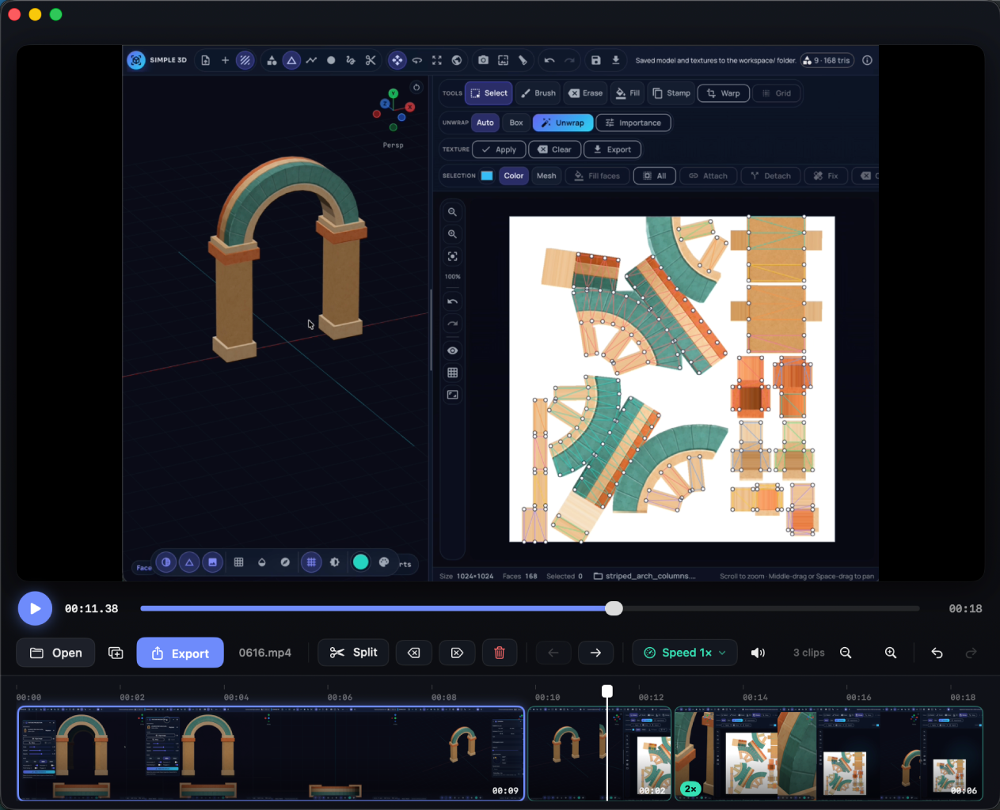

# Reel

**A simple, native video editor for macOS.**


I just wanted a dead-simple way to trim, cut and speed up screen recordings on my
Mac — without launching a heavyweight timeline editor, learning a new tool, or
paying a subscription. So I built **Reel**: a small, fast, fully native app that
does the handful of things I actually need and nothing else.



## What it does

- **Record** any resizable portion of any connected display, with optional
  speaker/system audio.
- **Open** a MOV / MP4 (file dialog or just drag-and-drop).
- **Append** more clips at the end — different sizes/orientations are aspect-fit
  into a common frame automatically.
- **Split & trim** — drop the playhead and hit **Split**, **Delete** a chunk, or
  trim the start/end with **Delete Before / After**. Select a clip to reveal
  green handles wherever source footage can be recovered; drag either direction
  to extend or shorten that edge, or double-click it to restore the entire side.
- **Reorder** clips by dragging them directly in the timeline — it autoscrolls
  when you hold a clip near either edge — or use the earlier/later buttons.
- **Re-time** — change the playback **speed** of selected clips (or all of them),
  from presets or any custom value you type.
- **Mute video audio** with one click.
- **Add a separate audio track** for music or narration. It appears as a thin
  lane above the video and supports the same selection, cut, trim, move and
  speed tools, plus volume and fade-in / fade-out controls. This track stays
  audible when the video-audio mute toggle is on.
- **Undo / Redo** every edit.
- **Preview & scrub** with a zoomable timeline — what you preview is exactly what
  you export.
- **Export** to **MP4**, or **Copy** the edited video directly to the clipboard,
  with shared fixed-resolution or 75% / 50% / 25% resize options and six H.264
  / HEVC compression levels.

That's the whole app. No accounts, no cloud, no watermark.

## Record a screen region

1. Click **Record** (or press **⇧⌘R**).
2. On any connected display, drag to draw a new region, drag inside the dotted
   border to move it, or use the eight handles to resize it exactly.
3. Leave **Speaker audio** checked to include the sound playing through macOS,
   or turn it off for a silent recording.
4. Click **Record** in the floating selection controls.
5. Click the red dot in the macOS menu bar and choose **Stop Recording**, or
   press **⌘Esc** when you are done.

Recordings are saved as MOV files in `~/Movies/Reel` and open in Reel
automatically, ready to trim or export. If a video is already open, the new
recording is appended to the end of its timeline instead. Reel's own windows and
sounds are excluded from the capture.

The first time you record, macOS asks for Screen & System Audio Recording
permission. If permission still needs to be enabled, Reel opens **System
Settings → Privacy & Security → Screen & System Audio Recording** directly;
enable Reel there, then relaunch the app. If Reel is not yet listed, click
**Add** and select the copy of `Reel.app` you are running.

## Download

Grab the latest **`Reel.zip`** from the
[Releases](https://github.com/LorenzGit/video-edit/releases/latest) page — no
Xcode needed. Unzip it and drag **Reel.app** into your Applications folder.

Reel is a free build that isn't signed through Apple's paid Developer Program, so
the first time you open it macOS will say it can't verify the app. That's normal
for indie apps shared this way — the entire source is right here if you'd rather
build it yourself. To open it the first time:

1. Double-click **Reel.app** (macOS blocks it on the first try).
2. Go to **System Settings → Privacy & Security**, scroll down, and click
   **Open Anyway** next to the note about Reel.
3. Confirm once more. macOS remembers your choice from then on.

Prefer the terminal? One line clears the quarantine flag:

```sh
xattr -dr com.apple.quarantine /Applications/Reel.app
```

## Requirements

- macOS 14.0 or later
- Xcode 16 or later (built and tested with Xcode 26.5)

## Build & run

The Xcode project is generated with [XcodeGen](https://github.com/yonaskolb/XcodeGen)
from `project.yml`, and is already checked in, so you can open it directly:

```sh
open Reel.xcodeproj
```

Then press **⌘R** in Xcode to build and run. (The first run signs the app to run
locally with your own developer identity.)

If you change `project.yml` or add/remove source files, regenerate the project:

```sh
xcodegen generate
```

The app's bundle identifier is `com.gamojo.reel`. If you fork Reel and ship your
own build, change `bundleIdPrefix` / `PRODUCT_BUNDLE_IDENTIFIER` in `project.yml`
to your own.

To produce a distributable build yourself — certificate-signed when an Apple
Development identity is available, otherwise ad-hoc signed — run:

```sh
./scripts/build-release.sh   # writes dist/Reel.zip
```

The release script embeds a stable local signing requirement so macOS keeps the
Screen Recording permission associated with Reel across subsequent local
rebuilds.

## Keyboard shortcuts

| Action                    | Shortcut     |
|---------------------------|--------------|
| Open video                | ⌘O           |
| Import video at end       | ⌘I           |
| Add / replace audio track | ⌥⌘A          |
| Record / stop screen      | ⇧⌘R          |
| Stop screen recording     | ⌘Esc         |
| Export as MP4             | ⌘E           |
| Copy video to clipboard   | ⇧⌘C          |
| Play / Pause              | Space        |
| Split at playhead         | ⌘B           |
| Move clip earlier / later | ⌥⌘← / ⌥⌘→    |
| Delete before playhead    | ⌘[           |
| Delete after playhead     | ⌘]           |
| Delete selected clip      | ⌫            |
| Mute / restore video audio| ⌘M           |
| Zoom in / out / fit       | ⌘+ / ⌘- / ⌘0 |
| Undo / Redo               | ⌘Z / ⇧⌘Z     |

## How it works

The whole timeline is just an ordered list of `Chunk`s
([`Sources/Models/Chunk.swift`](Sources/Models/Chunk.swift)), each holding a
`sourceID`, a source time range, and a speed multiplier. Every edit takes a
snapshot of that list for undo/redo, then rebuilds an `AVMutableComposition`
([`Sources/ViewModels/EditorViewModel.swift`](Sources/ViewModels/EditorViewModel.swift)):
each chunk's range is appended in order from its source video, and `scaleTimeRange`
applies its speed. A matching `AVVideoComposition` places every source — whatever
its size or orientation — into a common frame (the first clip's), aspect-fit and
centred. That one composition feeds both the live `AVPlayer` preview and the
`AVAssetExportSession` MP4 export, so what you preview is exactly what you export.

## Project layout

```
Sources/
  App/         ReelApp.swift, AppCommands.swift   (entry point + menu shortcuts)
  Models/      Chunk, ImportedAudioTrack             (video/audio timeline models)
  ViewModels/  EditorViewModel.swift                (player, edits, undo, export)
  Views/       ContentView, PreviewSection, TransportBar, ControlBar, SpeedControl,
               TimelineView, EmptyStateView, ExportOverlay, StatusToast
  Support/     Theme, Formatting, VideoExporter     (styling + export helpers)
```

The timeline is horizontally scrollable and zoomable; muting video audio drops
the source clips' audio track from the composition entirely. The separately
imported audio clips are inserted on their own composition tracks with an audio
mix for volume and fades, so they remain present in preview, export, and
clipboard copies regardless of that mute toggle.
Screen recording uses ScreenCaptureKit for an exact display-relative region and
AVAssetWriter for the MOV file, including an AAC system-audio track only when
requested.

## License

[MIT](LICENSE) — do whatever you like with it. If you build something fun on top,
I'd love to hear about it.
